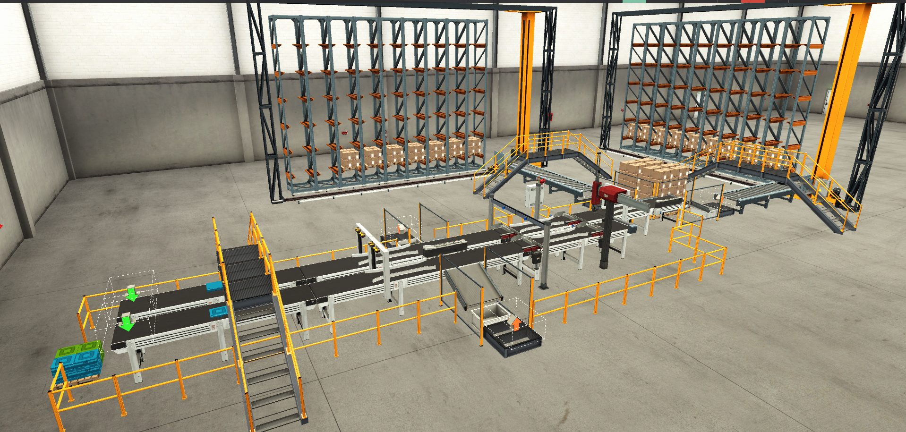
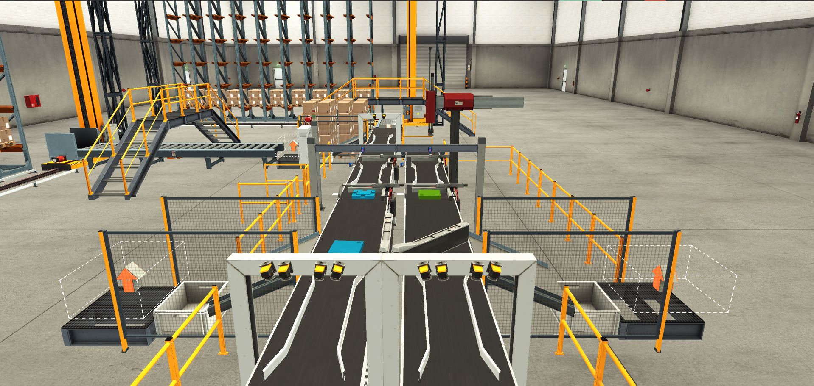

# 🎨 Color Sorting and Part Assembly Simulation

A PLC-based industrial automation simulation implementing automated color sorting and part assembly sequencing, built using Omron CP1E ladder diagram logic and visualized in Factory I/O.

---

## 🔍 Overview

This project simulates a real-world manufacturing automation process combining quality inspection, pick-and-place assembly, and color-based sorting in a single sequential line. Base and lid parts are first inspected by vision sensors for quality — Good parts proceed through an automated pick & place sequence (Move X/Z, Grab, Clamp) to be assembled, then classified by color (Blue/Green) and diverted via pivot arm sorters into Merah/Hijau/Kuning stack stations. The system is programmed using Omron CP1E PLC with ladder diagram logic via CX-Programmer, communicating in real time with Factory I/O through an **OPC Server** — enabling the 3D simulation to mirror actual PLC I/O behavior.

The project reflects core automation principles used in automotive and manufacturing production lines, including object detection, classification logic, and synchronized actuator sequencing.

---

## ⚙️ System Architecture

```
[Part Input on Conveyor]
        ↓
[Vision Sensors 1-4 — Good/Not Good Detection]
        ↓
   [NOT GOOD] → Reject/Divert Out
        ↓
     [GOOD]
        ↓
[Pick & Place — Base & Lid Assembly (Grab, Clamp, Move X/Z)]
        ↓
[Sorting Colour Sensors (Blue/Green) — Color Detection]
        ↓
[Pivot Arm Sorters 1-3 — Diverts by Color]
        ↓
[Stack Station — Merah / Hijau / Kuning]

   ┌─────────────────────────────────────┐
   │   Omron CP1E PLC (Ladder Diagram)    │
   │   ←──── OPC Server ────→             │
   │   Factory I/O (3D Simulation)        │
   └─────────────────────────────────────┘
```

> Communication between CX-Programmer (Omron CP1E) and Factory I/O is established via an **OPC Server**, enabling real-time I/O data exchange between the PLC ladder logic and the 3D simulation environment.

---

## 🛠️ Components (Simulated in Factory I/O)

| Component | Function |
|---|---|
| Conveyor Belt (1-4) | Transports parts through inspection, assembly, and sorting stages |
| Vision Sensors (1-4) | Detects part quality and presence at each stage — Good/Not Good classification |
| Pick & Place Mechanism | Performs Move X/Z, Grab, Clamp Lid, Clamp Base for assembly |
| Lid/Base Gate Sensors | Detects lid and base position before assembly |
| Sorting Colour Sensors | Detects Blue and Green for color-based classification |
| Pivot Arm Sorters (1-3) | Diverts assembled parts into respective color/stack lanes |
| Stack Station (Merah/Hijau/Kuning) | Final output stacking by color category |
| Emergency Stop & Buzzer | Safety stop mechanism with audible alarm |
| Indicator Lights (Hijau/Merah/Kuning) | Visual status indicators for system state |

---

## 🔢 Full I/O List

### Output
| Address | Description |
|---|---|
| 100.00 | L Hijau (Green Lamp) |
| 100.01 | L Merah (Red Lamp) |
| 100.02 | Conveyor 1 Kanan |
| 100.03 | Conveyor 2 Kiri |
| 100.04 | Conveyor 3 Kanan |
| 100.05 | Conveyor 4 Kiri |
| 100.06 | Pivot Arm Sorter 1 |
| 100.07 | Pivot Arm Sorter 2 |
| 101.00 | Pivot Arm Sorter 1 Belt + |
| 101.01 | Pivot Arm Sorter 2 Belt + |
| 101.02 | Move X |
| 101.03 | Move Z |
| 101.04 | Grab |
| 101.05 | Clamp Lid |
| 101.06 | Clamp Base |
| 101.07 | Pos Raise Base |
| 102.00 | Pos Raise Lid Gate |
| 102.01 | Pos Raise Base Gate |
| 102.02 | Pivot Arm Sorter 3 |
| 102.03 | Pivot Arm Sorter 3 Belt + |
| 102.04 | Buzzer Emergency |
| 102.05 | L Kuning (Yellow Lamp) |
| 102.06 | Stack Merah (Red) |
| 102.07 | Stack Hijau (Green) |
| 103.00 | Stack Kuning (Yellow) |

### Input
| Address | Description |
|---|---|
| 0.00 | PB Start |
| 0.01 | PB Stop |
| 0.02 | Vision Sensor 1 |
| 0.03 | Vision Sensor 2 |
| 0.04 | Vision Sensor 3 |
| 0.05 | Vision Sensor 4 |
| 0.06 | Lid Clamped |
| 0.07 | Lid at Place |
| 1.00 | Base at Place |
| 1.01 | Lid Gate Sensor |
| 1.02 | Base Gate Sensor |
| 1.03 | Lid Blue Good |
| 1.04 | Lid Green Good |
| 1.05 | Base Blue Good |
| 1.06 | Base Green Good |
| 1.07 | Sorting Colour Blue Sensor |
| 3.00 | Sorting Colour Green Sensor |
| 3.01 | Emergency Stop |

---

## 💻 Software & Tools

| Tool | Usage |
|---|---|
| CX-Programmer | Ladder diagram programming for Omron CP1E |
| Factory I/O | 3D industrial process simulation & visualization |
| OPC Server | Real-time communication bridge between PLC (CX-Programmer) and Factory I/O |

---

## 🔧 Features

- **Quality inspection logic** — 4 vision sensors detect and classify base/lid parts as Good or Not Good before assembly
- **Automated pick & place assembly** — coordinated Move X/Z, Grab, and Clamp sequence joins base and lid for Good parts
- **Color-based sorting logic** — Blue/Green colour sensors classify assembled parts after the assembly stage
- **Multi-stage conveyor system** — 4 independent conveyors (left/right direction) transport parts across inspection, assembly, and sorting stages
- **Pivot arm sorting mechanism** — 3 pivot arm sorters divert parts into Merah/Hijau/Kuning stack stations based on color classification
- **OPC Server communication** — real-time, bi-directional I/O data exchange between Omron CP1E ladder logic and Factory I/O simulation
- **Safety system** — emergency stop input with buzzer alarm output for fault conditions
- **Modular ladder logic design** — separate logic blocks for inspection, assembly, and sorting, reflecting structured PLC programming practice

---

## 🔄 Sequence of Operation

1. Operator presses **PB Start** → conveyors begin running
2. Base and lid parts move along Conveyor 1-2 → **Vision Sensors 1-4** inspect part quality
3. Lid/Base Gate Sensors detect part arrival at the assembly position
4. Pick & place mechanism executes: **Move X → Move Z → Grab → Clamp Lid → Clamp Base**
5. Assembled part (base + lid) proceeds toward the color inspection stage
6. **Sorting Colour Sensors** detect Blue or Green classification
7. Corresponding **Pivot Arm Sorter (1-3)** activates to divert the part
8. Part is directed to **Stack Merah / Hijau / Kuning** based on final classification
9. Cycle repeats automatically for the next part
10. **PB Stop** or **Emergency Stop** halts the system at any time, triggering the buzzer alarm if activated via emergency stop

---

## 📁 Repository Structure

```
color-sorting-part-assembly/
├── ladder-diagram/
│   └── color_sorting_assembly.cxp   # CX-Programmer project file
├── factory-io/
│   └── simulation_scene.fsim        # Factory I/O scene file
├── opc-config/
│   └── io_list.xlsx                 # Full I/O list & OPC tag mapping
├── docs/
│   └── images/                      # Simulation screenshots & video
└── README.md
```

---

## 📸 Documentation

> Add simulation screenshots/video to `/docs/images/` and update links below.

| Factory I/O Overview | Quality Inspection & Assembly | Color Sorting Process |
|---|---|---|
|  | https://youtu.be/RCQ-_9SGIMo?si=SZF84J3Bz39ZUnEy |  |

---

## 🚀 How to Run

1. **Open ladder diagram**
   - Open `ladder-diagram/color_sorting_assembly.cxp` using CX-Programmer
   - Review or simulate the ladder logic

2. **Configure OPC Server**
   - Set up an OPC Server (e.g., CX-Server / OPC-compatible driver) to bridge CX-Programmer and Factory I/O
   - Map PLC I/O addresses (see `opc-config/io_list.xlsx`) to corresponding Factory I/O tags

3. **Open Factory I/O scene**
   - Open `factory-io/simulation_scene.fsim` in Factory I/O
   - Select the OPC driver and connect to the configured OPC Server

4. **Run simulation**
   - Start the PLC program in RUN mode
   - Press **PB Start** in Factory I/O
   - Observe automated inspection, assembly, and color sorting sequence

---

## 👤 Author

**Farhan Ibnufajar**
Electrical Engineering — Universitas Jenderal Soedirman (Unsoed)

[](https://github.com/farhanibnufajar)
[](https://farhanibnufajar.github.io)

---

## 📄 License

This project is open source and available under the [MIT License](LICENSE).
